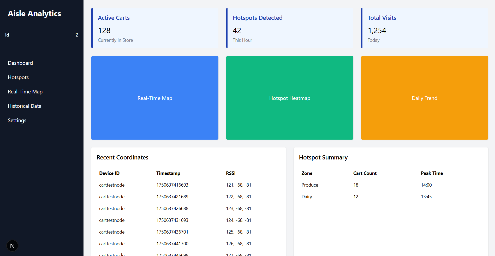

# Aisle

## Overview
Aisle is an IoT retail tracking prototype combining ESP32-based BLE scanning and AWS IoT MQTT messaging with an optional Next.js dashboard for monitoring device status and metadata (or integrated directly into the customer's existing visualization platform)

## Repository Layout
- `Ble/` ESP32 firmware (BLE scanning, MQTT connectivity, certificates).
- `components/`, `pages/`, `styles/` Next.js dashboard UI.
- `aisledash.png` Dashboard screenshot used in this README.

## Firmware (ESP32)
Key entry points:
- `Ble/Ble_Central.ino` BLE scanning and payload generation.
- `Ble/mqtt_test.cpp` AWS IoT Core MQTT test client.
